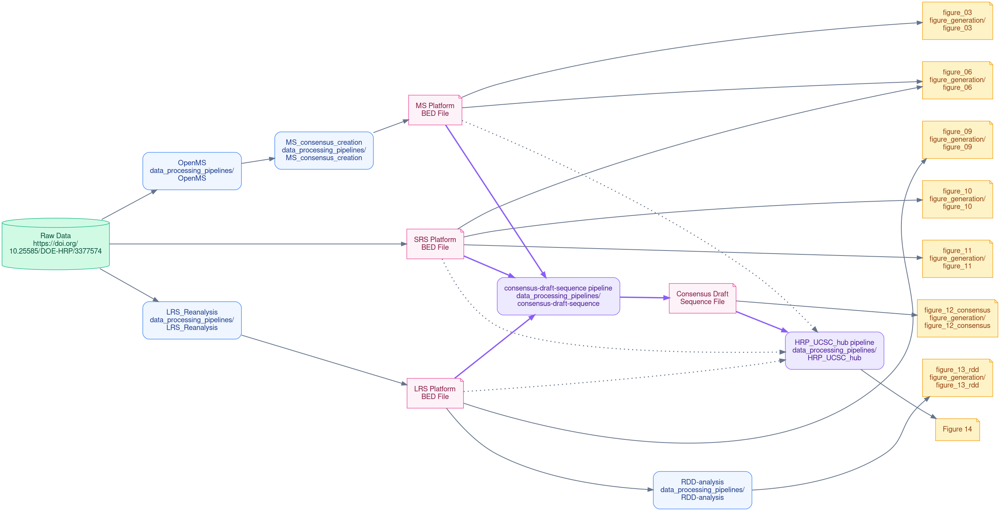

# Human RNome Project

Reference sequences of full-length RNA transcripts and their chemical modifications, built through open international collaboration.

[HumanRNomeProject.org](https://humanrnomeproject.org)

---

## About

The Human RNome Project is an international scientific consortium dedicated to building reference sequences of full-length RNA transcripts and their chemical modifications. By integrating complementary measurements from short-read sequencing, long-read direct RNA sequencing, and mass spectrometry, the consortium is creating reference Human RNome sequences that will serve as foundational resources for RNA biology, biotechnology, and precision medicine.

## Mission

The Human RNome Project develops community standards, reference datasets, analytical methods, and open resources that enable accurate, reproducible, and interoperable characterization of RNA chemical modifications. Through international collaboration, the project aims to accelerate the discovery of RNA biology and its translation to human health, agriculture, and biomanufacturing.

## HRP-benchmarking-project repository

[HRP-benchmarking-project](https://github.com/Human-RNome-Project/HRP-benchmarking-project) repository contains the analysis workflows, software and documentation developed by the Human RNome Project consortium. These resources support reproducible analysis of RNA modifications across complementary technologies, including short-read sequencing, direct long-read RNA sequencing, and mass spectrometry. The repository provides standardized pipelines from raw data through processed benchmark datasets and enables transparent comparisons of RNA modification measurements across laboratories and technologies.

### Data Journey

This guide explains how we take raw data from our experiments and turn it into the final figures and results you see in the paper. It also explains the HRP-benchmarking-project repository structure.  

**The Big Picture:** Our project uses three different technologies to study RNA. Each technology has its own automated pipeline to clean and analyze the data. Once the data is analyzed, we do two things:
1. **Build the Consensus:** We combine the processed data from all three technologies to create one master map of the RNA.
2. **Create Specific Figures:** We use the processed data from each technology (and the consensus) to make specific charts and graphs.

Here is a simplified flowchart of the process:

#### Phase 1: Analyzing the Raw Data
* **Long-Read Sequencing:** The raw data is processed using `data_processing_pipelines/LRS_Reanalysis/`. We also perform secondary error-checking (RNA-DNA Differences) on this data using `data_processing_pipelines/RDD-analysis/`.
* **Short-Read Sequencing:** The data is processed through short-read sequencing analysis pipelines to generated SRS platform specific bed files.
* **Mass Spectrometry:** The raw data is processed using `data_processing_pipelines/OpenMS/`, and its platform-specific BED file is generated by `data_processing_pipelines/MS_consensus_creation/`.

#### Phase 2: The Consensus (Combining the Data)
We merge the results from all three methods to create a "Consensus" reference sequence, a combined map of the RNA.
* **The Code:** You can find the code that merges everything together in `data_processing_pipelines/consensus-draft-sequence/`.
* **Web Visualization:** We also convert this master map and platform specific results into a format that can be viewed interactively in a web browser. This code is in `data_processing_pipelines/HRP_UCSC_hub/`.

#### Phase 3: Creating the Figures
Once the data is analyzed and the consensus is built, we use short, simple scripts to draw the actual figures for the paper. All of these drawing scripts are neatly organized by figure number in the `figure_generation/` folder. 

For example, to draw Figure 3, you just run the code in the `figure_generation/figure_03/` folder.

---

## Data and Benchmark Datasets

The raw data and benchmark datasets associated with this repository are available at DOE Data Explorer [https://doi.org/10.25585/DOE-HRP/3377574](https://doi.org/10.25585/DOE-HRP/3377574).

## Citation

*Coming soon.*

## Contributing

We welcome contributions from the community. Please open an issue to discuss proposed changes, report problems, or suggest improvements. For consortium participation and collaboration inquiries, please contact team leaders.

## Contact and More Information

For more information about the consortium, ongoing projects, publications, and community participation, visit [humanrnomeproject.org](https://humanrnomeproject.org).
